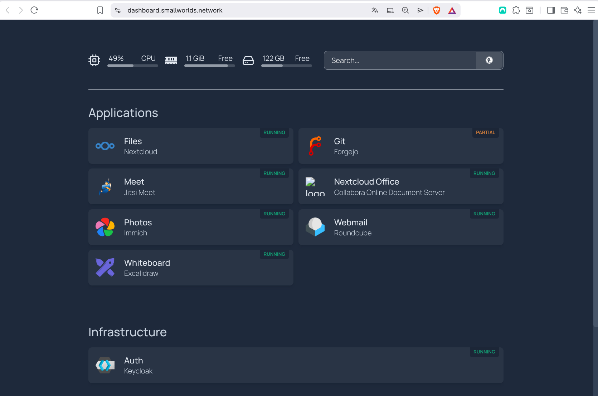

# SmallWorlds Setup Guide

<p align="center">
  <br>
  <em>The SmallWorlds dashboard — auto-discovered applications and infrastructure at a glance.</em>
</p>

> [!WARNING]
> **Prototype — not production-ready.** SmallWorlds is still in an early prototyping state. It is intended for experimentation and evaluation only, and is **not yet suitable for production environments**. Expect breaking changes, incomplete hardening, and no stability or upgrade guarantees. Use at your own risk.

> [!IMPORTANT]
> **Hetzner Cloud only.** The current `smallworlds-init.sh` bootstrap script and the bundled Terraform assume deployment to **Hetzner Cloud** — they provision an `hcloud_server`, manage DNS through the Hetzner API, and rely on Hetzner-specific storage. Running it requires a Hetzner Cloud account and an API token. Other providers are not yet supported; targeting one would require replacing the Terraform in `infrastructure/terraform/` and the storage/DNS assumptions in the init script.

This document outlines the deployment process for a SmallWorlds GitOps cluster. The architecture relies on an upstream foundation repository and a private, user-controlled configuration repository.

> [!TIP]
> Refer to the [SmallWorlds Architecture Diagram](smallworlds_architecture.md) for system topology and data flows.

## System Components

This project is built upon several foundational open-source technologies, core infrastructure services (installed by default), and optional user applications (selectively installed during initialization):

### Infrastructure and Cluster Management

| Name | Source URL | Role in this Project |
| :--- | :--- | :--- |
| **Terraform** | [terraform.io](https://www.terraform.io/) | Infrastructure as Code tool used to provision the underlying cloud resources and bootstrap the cluster. |
| **Kubernetes** | [kubernetes.io](https://kubernetes.io/) | Core container orchestration system that serves as the foundation for the cluster. |
| **Argo CD** | [argoproj.github.io/cd](https://argoproj.github.io/cd/) | GitOps continuous delivery tool that synchronizes cluster state with the configuration repository (accessible at `deploy.<domain>`). |
| **Velero** | [velero.io](https://velero.io/) | Cluster backup and disaster recovery solution. |
| **Grafana** | [grafana.com](https://grafana.com/) | Operational dashboard for cluster monitoring and observability. |
| **CloudNativePG** | [cloudnative-pg.io](https://cloudnative-pg.io/) | High-availability PostgreSQL database clustering. |
| **Garage** | [garagehq.deuxfleurs.fr](https://garagehq.deuxfleurs.fr/) | S3-compatible object storage backend. |
| **Homepage** | [gethomepage.dev](https://gethomepage.dev/) | Application dashboard automatically configured and accessible at `dashboard.<domain>`. |
| **Keycloak** | [keycloak.org](https://www.keycloak.org/) | Identity Provider (IdP) for Single Sign-On (SSO) and WebAuthn/Passkey management. |
| **Stalwart** | [stalw.art](https://stalw.art/) | Self-hosted mail server with OIDC directory integration. |
| **Traefik** | [traefik.io](https://traefik.io/) | Ingress routing and reverse proxy for handling incoming requests. |
| **Cert-Manager** | [cert-manager.io](https://cert-manager.io/) | Automated TLS certificate provisioning and management. |

### End User Applications

| Name | Source URL | Role in this Project |
| :--- | :--- | :--- |
| **Collabora Online** | [collaboraonline.com](https://collaboraonline.com/) | Powerful online office suite for collaborative document editing. Integrated into Nextcloud. |
| **Excalidraw** | [excalidraw.com](https://excalidraw.com/) | Virtual collaborative whiteboard tool. |
| **Forgejo** | [forgejo.org](https://forgejo.org/) | Git repository management and software collaboration. |
| **Immich** | [immich.app](https://immich.app/) | High performance photo and video backup. |
| **Jitsi Meet** | [jitsi.org](https://jitsi.org/) | Secure video conferencing and communication platform. |
| **Nextcloud** | [nextcloud.com](https://nextcloud.com/) | File synchronization and collaboration. |
| **Plane** | [plane.so](https://plane.so/) | Open-source project management tool. |
| **Roundcube** | [roundcube.net](https://roundcube.net/) | IMAP webmail client connected to Stalwart. |

---

## Deployment Instructions

### 1. Configuration Repository Initialization
A private Git repository is required to store application state and configuration overrides.

First create a completely empty private repo, e.g. at https://github.com/your-username/my-community-config . Make sure to create a Personal Access Token as a password to be able to push to this repo later.

Then Execute the initialization script from the root of this repository:
```bash
./admin-tools/prepare-community-repo.sh
```
This script handles:
- Interactive selection of optional applications.
- Generation of the corresponding `kustomization.yaml` overlay.
- Initialization of the local Git repository and initial commit.

Make sure to push the state to the remote repo (the script will ask you to do so)

### 2. Infrastructure Provider Setup
SmallWorlds currently supports **Hetzner Cloud only** — the init script and Terraform are written against it, so these steps are required (see the note at the top of this README).
1. Create a Hetzner Cloud account and a new project.
2. Generate an API Token with **Read & Write** permissions. Save this token.

### 3. Cluster Provisioning
Execute the bootstrap script to provision the VM, configure DNS, and install Kubernetes/ArgoCD.

```bash
git clone https://github.com/stephan271/smallworlds.git
cd smallworlds
./smallworlds-init.sh
```
When prompted for Git credentials, provide:
- **URL**: The HTTPS URL of your private configuration repository (SSH URLs are unsupported).
- **Username**: Your Git platform username.
- **Access Token**: A Personal Access Token (PAT) with read-only access to repository contents.

### 4. DNS Configuration
DNS records are automatically managed via the Hetzner API token provided during provisioning. Subdomains are routed to the provisioned server IP.

### 5. Authentication Configuration
By default, registration is invitation-only. To enable self-registration, patch the Keycloak configuration via your `kustomization.yaml`:

```yaml
patches:
  - target:
      kind: Job
      name: keycloak-realm-config
      namespace: keycloak
    patch: |-
      - op: replace
        path: /spec/template/spec/containers/0/env/1/value
        value: "self-registration"
```

### 6. Custom Application Deployment
To deploy external applications, add standard Kubernetes manifests to your configuration repository and declare them in your `kustomization.yaml`. ArgoCD will synchronize the state.

---

## Maintenance Operations

### Rebuild (Preserve Data)
This procedure replaces the VM while retaining the persistent volume containing cluster state and data.
```bash
cd infrastructure/terraform
terraform destroy -target=hcloud_server.smallworlds_pilot_node
terraform apply
```

### Clean Rebuild (Wipe Data, Preserve TLS Certificates)
This procedure wipes all cluster data but backups TLS certificates to avoid Let's Encrypt rate limits.
```bash
./admin-tools/prepare-fresh-rebuild.sh
cd infrastructure/terraform
terraform destroy -target=hcloud_server.smallworlds_pilot_node
terraform apply
```

### Managing Updates — the two-repo model

SmallWorlds runs on **two repositories**, and understanding their interplay is the key to safe day-2 operations:

| Repo | Role | Who changes it |
| :--- | :--- | :--- |
| **`smallworlds`** (this repo, public) | The upstream **base**: all app/infra manifests under `infrastructure/kubernetes/`. Released as semver tags (`v1.0.0`, `v1.1.0`, …). | The SmallWorlds project. |
| **`my-community-config`** (yours, private) | The **overlay** ArgoCD actually deploys from. Each app's `kustomization.yaml` remote-references the base at a **pinned tag** (`?ref=v1.0.0`) plus your local patches. | You, the operator. |

**ArgoCD only watches your private overlay.** It does *not* track the base's moving branch. Because the overlay pins the base to an **immutable tag**, upstream changes never reach your cluster on their own — adopting a new base version is always a deliberate, auditable action in *your* repo.

> [!NOTE]
> This separates two independent concerns. **Drift reconciliation** (ArgoCD `selfHeal`) keeps the cluster matching whatever is *declared* and stays on — it's safe and low-risk. **Version adoption** (moving to newer upstream code) is the deliberate lever described below. Don't conflate them.

#### Adopting a new release manually

Bump the pinned tag everywhere in your overlay and commit — ArgoCD (which watches this repo) then syncs the change deterministically:

```bash
# in my-community-config, e.g. v1.0.0 -> v1.1.0
grep -rl 'v1.0.0' . | xargs sed -i 's#v1.0.0#v1.1.0#g'
git commit -am "Bump upstream smallworlds base to v1.1.0" && git push
```

Rollback is just as simple: revert that commit. Because the ref is immutable, what you tested is exactly what deploys.

> [!TIP]
> `prepare-community-repo.sh` pins to a release tag by default (it prompts for the version). You *can* answer `HEAD` to always track the latest `main`, but avoid it in production: ArgoCD only re-pulls a floating `HEAD` non-deterministically (on cache expiry), so you lose reproducibility and can't tell what's actually running.

#### Automated weekly update proposals (Renovate)

An in-cluster **Renovate** CronJob is pre-wired to reduce the toil without giving up control. Every Monday it opens **one pull request** in your private overlay that bumps the pinned base tag to the newest `smallworlds` release (config in `my-community-config/renovate.json`). It does **not** auto-merge — you review the changelog and merge when ready; the merge is the commit that triggers ArgoCD. This gives you a low-effort cadence *and* a human gate *and* a full audit trail.

Requirements for the PR automation:
- The private overlay must be listed in the Renovate CronJob's `RENOVATE_REPOSITORIES` (added via an overlay patch in your `kustomization.yaml`, so operator-specific config stays out of the public base).
- The Git token Renovate uses (`repo-git-creds`) must have **pull-request / write** access to the private overlay repo, not just read.

---

## End-to-End Smoke Tests

Browser-based Playwright smoke tests simulate real users logging in via SSO and exercising each application. They live in `e2e-tests/tests` and run against a **live** SmallWorlds community.

```bash
./e2e-tests/run-smoke-tests.sh <domain> [keycloak-admin-password]

# e.g.
./e2e-tests/run-smoke-tests.sh smallworlds.network
```

If the Keycloak admin password is omitted, the runner reads it from the cluster via `kubectl`. The script checks service availability, provisions two test users (`sw-test-alice`, `sw-test-bob`), and runs the suite.

### OIDC test depth (two-tier)

Full OIDC login roundtrips require the applications to trust the TLS certificate of `identity.<domain>` for their server-side discovery/token calls. That holds in production (Let's Encrypt) but is structurally impossible on ephemeral staging clusters. The suite therefore runs at one of two depths:

| Mode | How to run | What it verifies |
| :--- | :--- | :--- |
| **Shallow wiring** (default) | `./e2e-tests/run-smoke-tests.sh <domain>` | Each app redirects into Keycloak's authorize endpoint — proving client config, secrets, issuer URL, in-cluster DNS, and OIDC wiring. The deeper login-roundtrip tests are skipped. |
| **Full OIDC** | `FULL_OIDC=1 ./e2e-tests/run-smoke-tests.sh <domain>` | The complete login roundtrips run — auto-login into each app, then asserting the app's authenticated UI loads (Files listing, inbox, timeline, dashboard, etc.). Requires app-trusted certificates, i.e. production. |

In shallow mode you'll see the roundtrip tests reported as **skipped** (with the reason `Full OIDC roundtrip needs app-trusted certificates — run with FULL_OIDC=1`); this is expected, not a failure.

### Other options

These environment variables override the CLI arguments:

| Variable | Effect |
| :--- | :--- |
| `DOMAIN` | Target domain (alternative to the first positional argument). |
| `KC_ADMIN_PASS` | Keycloak admin password (alternative to the second positional argument). |
| `FULL_OIDC=1` | Run the full OIDC login roundtrips (see above). |
| `HEADED=1` | Run in headed browser mode instead of headless. |
| `SLOWMO=500` | Slow operations down by the given number of milliseconds — useful when watching a headed run. |
| `SKIP_PROVISION=1` | Skip test-user provisioning (reuse existing `sw-test-*` users). |
| `KUBECONFIG` | Path to the kubeconfig used to read the admin password. |

The HTML report is written to `e2e-tests/reports/html`; view it with `cd e2e-tests && npx playwright show-report reports/html`.

---

## Developer Guide: Adding a New Application

When adding a new application (tenant) to the SmallWorlds cluster, please ensure you complete all the items on this integration checklist:

- **Pin Specific Versions**: Always use a specific, stable container image tag (e.g., `v2.4.1` or `24.04`) rather than `latest` in your Kubernetes manifests to ensure reproducible deployments.
- **Add E2E Tests**: Write end-to-end smoke tests (using Playwright) in the `e2e-tests/tests` directory to verify the application's core functionality and SSO integration.
- **Integrate with Dashboard**: Add Homepage annotations (e.g., `gethomepage.dev/enabled: "true"`) to the application's Ingress resource so it automatically appears in the user dashboard.
- **Make it Selectable**: Add the application's identifier to the `OPTIONAL_APPS` array in the `admin-tools/prepare-community-repo.sh` script so users can easily toggle its installation.
- **Update the README Table**: Add the application to the "End User Applications" table in this README file, including a description and its source URL.
- **Document the Implementation**: Add a descriptive markdown file (or update an existing one) in the `doc/` directory detailing the application's YAML manifests, configurations, and architecture.
- **Configure DNS Records**: Add the application's generic subdomain (e.g., `whiteboard`, `meet`, `office`) to the DNS records array in `infrastructure/terraform/main.tf` so Terraform provisions the A-record.
- **Provision Web Certificates**: Ensure the Ingress resource specifies the correct `cert-manager.io/cluster-issuer: letsencrypt-prod` annotation and the `tls` hosts block to automate Let's Encrypt SSL certificate generation.

# Talks

Watch the [SmallWorlds Lightning Talk](https://rawcdn.githack.com/stephan271/smallworlds/e117b19f2af5ec1e9511d56d8622406a7b312d1b/lightning_talk.html).