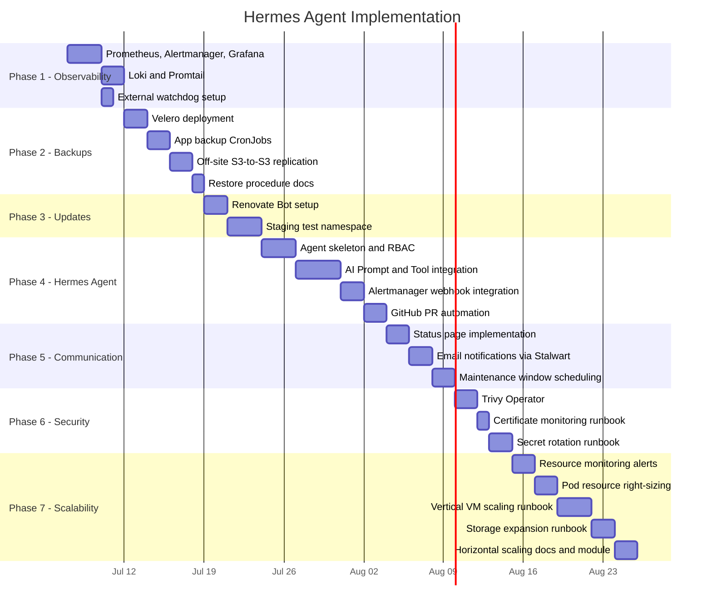

# AI Agent-Based Infrastructure Lifecycle Management for SmallWorlds

Build an autonomous agent system — **Hermes** — that manages the full operational lifecycle of the SmallWorlds K3s cluster. Hermes observes, decides, acts, and communicates — requesting human approval only for high-risk operations like major version upgrades.

## Resolved Design Decisions

All open questions have been resolved. This section documents the decisions for reference.

### Decision 1: Agent Technology — AI-Driven LLM Core

> [!NOTE]
> **Adopting a True AI Agent (NousResearch Hermes / LLM)**
>
> You are absolutely right — a purely deterministic, script-based approach lacks the "intelligence" of a true AI agent. To fulfill the vision of an autonomous AI manager, Hermes will use a Large Language Model (like NousResearch Hermes) as its core "Brain".
>
> To safely use a non-deterministic AI for infrastructure:
> 1. **Guardrails:** The AI will *not* have direct write access to the cluster. Instead, the AI's output is strictly formatted as Terraform or Kubernetes manifest changes, which it submits as **Pull Requests**. A human reviews and approves what the AI decided before it applies.
> 2. **Resource Cost:** Running a 7B+ LLM requires a GPU. Until the GPU cloud connection (Roadmap Phase 4.2) is established, the agent can use an external API (like OpenRouter or an external Ollama instance) to access the NousResearch Hermes model.
> 3. **The Agent Loop:** The agent uses an AI framework (like LangChain or a custom loop) with tools provided to it (e.g., `read_prometheus_metrics`, `read_loki_logs`, `create_github_pr`). When an alert fires, the AI uses these tools to investigate, reason about the root cause, and formulate a solution.

**Technology:** A Python agent loop (using an LLM framework) connected to an LLM provider (NousResearch Hermes). The agent is containerized and deployed as a Kubernetes Deployment with scoped, read-only RBAC, plus a GitHub token for creating PRs.

---

### Decision 2: Git Platform Strategy

> [!IMPORTANT]
> The infrastructure GitOps pipeline will continue to use **GitHub** (`github.com/stephan271/smallworlds`) as the source of truth.
>
> While Forgejo is deployed for user-facing Git hosting, moving infrastructure definitions *inside* the infrastructure they define creates a dangerous circular dependency. If the cluster experiences a catastrophic failure, you would lose the blueprints needed to rebuild it. Keeping GitHub as an external, independent source of truth ensures robust disaster recovery capability.

**Target state:** Hermes will interact directly with GitHub via its REST API to create PRs and manage Renovate configuration.

---

### Decision 3: Approval Channel — PR + Email

Human approval for major changes uses **both channels**:
- **Git PR** (on the active Git platform) contains the actual change with full diff, metrics, and rationale.
- **Email** (via Stalwart) notifies the admin that a PR is waiting, with a direct link.

---

### Decision 4: Off-site Backup — Home Garage S3 Replica

Off-site backup destination is a **Garage S3 instance** running on a local server at the customer's home address. This is not yet set up. The backup replicator will use **S3-to-S3 replication** (rclone with S3 remotes on both sides), keeping a full replica of all user data on the home Garage server.

**Prerequisite:** A home server running Garage, accessible via VPN or a public endpoint with TLS.

---

### Decision 5: Update Policy

| Update Type | Examples | Agent Action |
|---|---|---|
| **Patch** (x.y.**Z**) | Immich 0.8.0 → 0.8.1, security fixes | Auto-merge after health check |
| **Minor** (x.**Y**.z) | Nextcloud 9.0.2 → 9.1.0 | Auto-merge after staging test |
| **Major** (**X**.y.z) | PostgreSQL 16 → 17, Keycloak major bump | **Create PR, notify human, wait for approval** |
| **Security (CVE)** | Critical CVE in base image | Fast-track: auto-apply patch, notify human |
| **Operator** | CNPG 0.27.1 → 0.28.0 | Create PR, notify human |

**Learning Mode:** During initial deployment, a configurable `learning_mode: true` flag in `hermes-config.yaml` causes minor updates to also require human approval. This allows the team to build confidence in the staging test pipeline before trusting it to auto-merge. Disable when ready.

---

### Decision 6: Hermes Scope Boundary

Hermes is explicitly **forbidden** from:
- Deleting namespaces or PVCs
- Modifying Keycloak realm configuration
- Scaling down to 0 replicas
- Accessing user data in application databases
- **Any deletion of user data** (backups, S3 objects, database records) — always requires human approval

These restrictions are enforced at the **RBAC level** (Kubernetes) and in the agent's configuration (runbook guardrails).

---

### Decision 7: Scaling Policy

- **Cost guardrails:** Soft cap with override — Hermes warns when a proposed scale-up exceeds the configured monthly budget, but still creates the PR. Human decides.
- **Scale-down aggressiveness:** Conservative — only recommend scale-down after **30 days** of sustained low utilization (< 30% CPU, < 40% memory).

---

## Current State Assessment

| Component | Status | Agent-Relevance |
|---|---|---|
| **ArgoCD GitOps** | ✅ Active, auto-sync from GitHub | Agent proposes changes via Git → ArgoCD applies them |
| **CloudNativePG** | ✅ Active, 2-instance HA | Daily scheduled backups to Garage S3 already configured |
| **Garage S3** | ✅ Active | Backup destination for CNPG; needs extension for app-level backups |
| **Helm Charts** | ✅ Pinned versions (Immich 0.8.0, Nextcloud 9.0.2, Forgejo 1.1.7, etc.) | Agent can bump these versions |
| **Keycloak SSO** | ✅ Active | All apps use OIDC via `keycloak-secret` |
| **Status Page** | 🟡 Designed (status.json data model exists) | Agent writes to this to inform users |
| **Forgejo** | ✅ Deployed | User-facing Git hosting |
| **Observability** | ❌ Not deployed | **Required first** — agent needs "senses" |
| **Backup (app-level)** | ❌ Only CNPG scheduled backups | Needs Velero + file-level backup |
| **CI/CD pipeline** | ❌ No GitHub Actions / Renovate | Needed for safe change proposals |

---

## Architecture Overview

```
                    ┌──────────────────────────┐
                    │  EXTERNAL WATCHDOG        │
                    │  (separate VPS / home)    │
                    │                           │
                    │  curl healthz every 60s   │
                    │  If unreachable:          │
                    │   → Email alert           │
                    │   → Hetzner API reboot    │
                    └─────────────┬─────────────┘
                                  │ monitors
                                  ▼
┌──────────────────────────────────────────────────────────────────┐
│                      HERMES AI AGENT  (inside cluster)           │
│                                                                  │
│  ┌──────────────┐  ┌────────────────┐  ┌──────────────────────┐ │
│  │  Observe      │  │  Decide (AI)    │  │  Act                 │ │
│  │  Prometheus   │→ │  NousResearch   │→ │  Propose Git        │ │
│  │  Loki         │  │  Hermes LLM     │  │  commits to GitHub  │ │
│  │  K8s API      │  │  (Reasoning &   │  │  (PRs for approval)  │ │
│  │  Hetzner API  │  │   Tool Use)     │  │                      │ │
│  └──────────────┘  └────────────────┘  └──────────────────────┘ │
│                           │                                      │
│  ┌────────────────────────┴─────────────────────────────────────┐│
│  │  Communicate: Status Page updates, Email via Stalwart        ││
│  └──────────────────────────────────────────────────────────────┘│
└──────────────────────────────────────────────────────────────────┘
         │                    │                    │
         ▼                    ▼                    ▼
  ┌────────────┐    ┌──────────────┐     ┌──────────────┐
  │ Prometheus │    │ GitHub        │     │  K8s API      │
  │ Loki       │    │ PRs, config  │     │  Hetzner API  │
  │ AlertMgr   │    │ repo         │     │  Terraform    │
  └────────────┘    └──────────────┘     └──────────────┘

Three independent safety layers:
  1. GitHub        — external blueprints (disaster recovery)
  2. Watchdog      — external liveness monitor (cluster-down detection)
  3. Hermes Agent  — internal AI intelligence (day-to-day operations)
```

---

## Implementation Phases

### Phase 1: Observability Stack (Agent's "Senses")

> [!IMPORTANT]
> This is the prerequisite for everything else. Without observability, the agent is blind.

Deploy Prometheus, Alertmanager, Loki, and Grafana as ArgoCD applications, following the existing pattern in [apps/](file:///home/robotwall-e/development/smallworlds/infrastructure/kubernetes/apps).

#### [NEW] `infrastructure/kubernetes/apps/kube-prometheus-stack.yaml`
ArgoCD Application deploying the `kube-prometheus-stack` Helm chart (Prometheus, Alertmanager, Grafana bundled).
- Prometheus scrapes all pod metrics, CNPG metrics (`ENABLE_METRICS: "true"` is already on), and node-level metrics.
- Alertmanager routes alerts to a webhook endpoint that the Hermes agent listens on.
- Grafana available at `monitoring.<domain>` for human oversight.
- Pre-configured alert rules for: pod crashloops, OOM kills, node disk pressure, certificate expiry (<14 days), CNPG replication lag, high error rates.

#### [NEW] `infrastructure/kubernetes/apps/loki-stack.yaml`
ArgoCD Application deploying Loki and Promtail for centralized log aggregation.
- Promtail collects logs from all pods.
- Loki stores logs with 30-day retention in Garage S3.
- Agent queries Loki via LogQL when investigating incidents.

#### [MODIFY] `infrastructure/kubernetes/namespaces.yaml`
Add `monitoring` namespace.

#### [MODIFY] `infrastructure/kubernetes/kustomization.yaml`
Add the two new app resources.

#### [NEW] `infrastructure/terraform/main.tf` (DNS record)
Add `monitoring` subdomain A record in the `hcloud_zone_rrset.app_records` for_each.

#### 1B: External Watchdog ("Who Watches the Watchmen")

> [!IMPORTANT]
> The Hermes AI agent runs inside the cluster and cannot detect its own death. This lightweight external watchdog covers the one failure mode Hermes can never handle: **total cluster unavailability**.

The watchdog is a minimal script deployed **outside** the SmallWorlds infrastructure (on a cheap separate VPS, a home server, or a free-tier cloud function like AWS Lambda / Cloudflare Worker).

#### [NEW] `admin-tools/watchdog/`
A self-contained watchdog package:

**`watchdog.sh`** (or `watchdog.py`) — A simple script run by cron every 60 seconds:
1. **Health check:** `curl -sf --max-time 10 https://status.smallworlds.network/healthz`
2. **If healthy:** Log timestamp, exit.
3. **If unreachable for 3 consecutive checks (3 minutes):**
   - Send email alert via an external SMTP provider (not Stalwart — it's inside the cluster).
   - Query Hetzner API for VM status (`hcloud server describe smallworlds`).
   - If VM is running but unresponsive → trigger `hcloud server reboot smallworlds`.
   - If VM is stopped → send critical alert: "VM is stopped, manual intervention required."
4. **If recovered after outage:** Send recovery notification.

**`watchdog-config.env`** — Configuration:
- `HEALTHCHECK_URL=https://status.smallworlds.network/healthz`
- `HETZNER_API_TOKEN=<read-write token for the project>`
- `ALERT_EMAIL=admin@smallworlds.network`
- `SMTP_HOST=<external SMTP, e.g., Mailgun, SendGrid, or a personal mail server>`
- `FAILURE_THRESHOLD=3` (consecutive failures before action)
- `AUTO_REBOOT=true` (set to false to only alert, never reboot)

**`watchdog-install.md`** — Setup instructions for deploying the watchdog on:
- A Hetzner CX11 (cheapest VPS, ~€3.50/month)
- A home Raspberry Pi or server
- A free-tier cloud function (AWS Lambda + CloudWatch Events)

> [!NOTE]
> The watchdog is intentionally **not managed by ArgoCD or Terraform** — it must be completely independent of the infrastructure it monitors. It's deployed manually once and forgotten.

**Health endpoint:** The cluster must expose a `/healthz` endpoint. This can be:
- A simple static page served by Traefik (already the ingress controller)
- Or the Hermes agent's own health endpoint (responds 200 when the agent loop is running)

#### [NEW] `infrastructure/kubernetes/tenants/hermes/healthz-ingress.yaml`
An Ingress resource that exposes the Hermes agent's `/healthz` endpoint externally so the watchdog can reach it. This endpoint confirms both that Traefik, the cluster, and the Hermes agent are all functioning.

---

### Phase 2: Backup and Restore System

The current setup only has CNPG scheduled backups (daily at 02:00 to `s3://postgres-backups/`). This phase adds comprehensive backup coverage.

#### 2A: Velero for Cluster State Backups

#### [NEW] `infrastructure/kubernetes/apps/velero.yaml`
ArgoCD Application deploying Velero with the AWS (S3-compatible) plugin, configured to use Garage.
- Daily cluster-state snapshots (all namespaces, excluding `kube-system`).
- 30-day retention policy.
- Backup schedules for each tenant namespace independently (so you can restore a single app).

#### 2B: Application Data Backups

#### [NEW] `infrastructure/kubernetes/bases/backup-job/`
A reusable Kustomize base for CronJob-based application data backups:
- Uses `rclone` to sync S3 buckets to a secondary backup destination.
- Each tenant includes this base and patches it with their specific bucket names.
- Supports configurable retention (daily for 7 days, weekly for 4 weeks, monthly for 12 months).
- Writes backup status to `status.json` on failure.

#### 2C: Off-site Backup Replication to Home Garage

#### [NEW] `infrastructure/kubernetes/apps/backup-replicator.yaml`
A CronJob that uses `rclone` with **S3-to-S3 replication** to sync all Garage data to a home-based Garage instance:
- Destination: A Garage S3 server running at the customer's home address.
- Connection: Via VPN tunnel or public TLS endpoint (to be set up as a prerequisite).
- Configuration via a Secret containing the home Garage S3 endpoint, access key, and secret key.
- Full replica of user data: each application's bucket is mirrored to the home Garage.
- Scheduling: nightly after CNPG backups complete (03:00 UTC).

> [!NOTE]
> The home Garage server is not yet operational. Phase 2C can be implemented with the configuration ready, but will remain dormant until the home server is provisioned and its credentials are provided.

#### 2D: Restore Procedures

#### [NEW] `admin-tools/restore-procedures.md`
Documented, tested restore procedures for each application:
- **CNPG databases**: Restore from barman backup using CNPG `recovery` bootstrap mode.
- **Velero**: `velero restore create` for full or partial namespace restoration.
- **S3 data**: `rclone sync` from home Garage back to cloud Garage.

---

### Phase 3: Version Update Management

#### 3A: Renovate Bot for Automated Version Detection

#### [NEW] Renovate configuration on GitHub
Renovate configuration to scan the SmallWorlds Git repository for:
- Helm chart version bumps in `kustomization.yaml` files.
- Container image tag updates in deployment manifests.
- Terraform provider version updates.

Renovate creates PRs with changelogs and compatibility notes.

#### 3B: Update Classification and Approval Workflow

The Hermes agent classifies each update and decides the approval level per the resolved update policy (see Decision 5). In **Learning Mode**, minor updates also require human approval.

#### 3C: Staging Namespace for Pre-flight Testing

#### [NEW] `infrastructure/kubernetes/bases/staging-test/`
A Kustomize base that spins up a temporary namespace with the updated version:
- Deploys the application with the new version.
- Runs health checks (HTTP readiness/liveness probes).
- Runs smoke tests (e.g., can the app connect to its database?).
- Tears down automatically after the test.
- Reports pass/fail to the agent.

---

### Phase 4: Hybrid Auto-Remediation System (Deterministic + Hermes AI)

To maximize reliability and minimize cost, we will implement a **Two-Tiered Hybrid Architecture**. Tier 1 handles predictable, standard issues deterministically with zero AI cost. Tier 2 (the Hermes AI Agent) acts as an escalation path for complex edge cases.

#### 4A: Tier 1 — Deterministic Auto-Remediation
Before waking up the AI, the cluster will attempt to fix itself using standard, zero-cost Kubernetes operators.

#### [NEW] `infrastructure/kubernetes/apps/auto-remediator.yaml`
Deploy lightweight controllers (e.g., standard Kubernetes HPA, or a tool like Robusta / Keptn) configured with static runbooks for "standard cases":
1. **OOM (Out of Memory) Kills**: Automatically bump memory limits by 20% and restart the pod.
2. **Disk Pressure**: Run a cleanup script to delete `/tmp` caches on the affected node.
3. **Database Replication Lag**: Automatically trigger a CNPG failover if the primary node goes down.
4. **Patch Updates**: Renovate Bot (configured in Phase 3) automatically merges non-breaking patch updates if the staging smoke test passes.

If a Tier 1 remediation fails (e.g., the pod OOM-kills *again* after the memory bump), or if an alert has no predefined runbook, it escalates to Tier 2.

#### 4B: Tier 2 — The Hermes AI Agent (Escalation Path)

This is the core intelligence. Hermes is deployed as a Kubernetes Deployment, remaining asleep until an Alertmanager webhook triggers an escalation.

#### [NEW] `infrastructure/kubernetes/tenants/hermes/`
A new tenant namespace containing:

**`hermes-deployment.yaml`** — The main agent container:
- A Python AI agent (using a framework like LangChain or AutoGen) that runs an autonomous loop:
  1. **Subscribe** to Alertmanager for incident triggers.
  2. **Investigate**: AI calls tools (e.g., `query_prometheus`, `fetch_pod_logs`) to gather context about the alert.
  3. **Reason**: AI analyzes the logs/metrics to determine the root cause.
  4. **Act**: AI generates Terraform or Kubernetes manifest patches to fix the issue, and uses the `create_github_pr` tool to submit them.
  5. **Communicate**: AI writes a human-readable summary of the incident and posts it to the status page and email.

**`hermes-rbac.yaml`** — Scoped Kubernetes RBAC (enforcing Decision 6):
- Read access to all namespaces (pods, deployments, services, events, logs).
- Write access to ConfigMaps in `dashboard` namespace (for `status.json`).
- Exec access for specific diagnostic pods only (not production apps).
- **No** cluster-admin access. The agent cannot delete namespaces or PVCs.
- **No** write access to user data volumes or application databases.

**`hermes-config.yaml`** — ConfigMap with:
- `learning_mode: true` (initial setting — causes minor updates to require approval).
- Alert classification rules (which alerts trigger which runbooks).
- Update policy rules (the approval matrix from Decision 5).
- Notification channels configuration.
- Escalation timeouts (how long to wait for human approval before reminding).
- `monthly_budget_soft_cap: 50` (euros — scaling cost guardrail from Decision 7).
- `scaledown_observation_days: 30` (conservative scale-down window from Decision 7).

**`hermes-sa-secret.yaml`** — ServiceAccount with GitHub API token for creating/merging PRs.

#### 4C: Agent Tools and Prompting

Instead of static YAML runbooks, the AI is provided with a system prompt and a set of specific tools it can invoke.

#### [NEW] `infrastructure/kubernetes/tenants/hermes/system-prompt.txt`
Defines the agent's persona and constraints:
- "You are Hermes, an autonomous SRE agent managing a K3s cluster."
- "You must never delete user data."
- "For any configuration change, generate the Git patch and submit a PR. Do not apply changes directly."

**Tool Definitions (Python functions provided to the LLM):**
- `get_alert_details(alert_id)`
- `query_logs(namespace, pod, tail_lines)`
- `query_metrics(promql_query)`
- `create_github_pr(repo, branch, file_changes, title, body)`
- `update_status_page(incident_summary, severity)`
- `send_email_notification(subject, body)`

When an escalated issue occurs, the AI uses `query_logs` to see what happened, realizes the standard remediation failed, modifies the deployment manifest with a complex fix, and uses `create_github_pr` to propose the fix. You review the AI's reasoning in the PR description before merging.

---

### Phase 5: Status Page and User Communication

Build on the existing [status page design](file:///home/robotwall-e/development/smallworlds/implementation_plan-statuspage.md) to create a complete communication system.

#### 5A: Status Page (Already Designed)

Implement the `status.json`-driven status panel as already specified. The Hermes agent becomes the primary writer to this ConfigMap.

#### 5B: Notification System

#### [NEW] `infrastructure/kubernetes/tenants/hermes/notification-channels.yaml`

The agent sends notifications through multiple channels using both PR and email (Decision 3):

| Channel | Use Case | Implementation |
|---|---|---|
| **Status Page** | All incidents and maintenance | `kubectl patch configmap status-data -n dashboard` |
| **Email** | Major incidents, approval requests, PR notifications | Via Stalwart SMTP (already deployed) |
| **Git PR** | All proposed changes requiring approval | Via GitHub API |
| **Matrix** (future) | Real-time ops channel | When Matrix is deployed (Roadmap Phase 3.2) |

Notification templates for:
- `incident-opened`: "⚠️ [Service] is experiencing [severity] issues. We are investigating."
- `incident-resolved`: "✅ [Service] is back to normal. Root cause: [summary]."
- `maintenance-scheduled`: "🔧 Scheduled maintenance: [description] on [date]. Affected: [services]."
- `update-available`: "📦 New version of [app] available: [old] → [new]. [Auto-applying/Awaiting approval]."
- `approval-required`: "🔒 [App] major update [old] → [new] requires your approval. Review PR: [link]."
- `scaling-recommended`: "⬆️ Scale-up recommended: [current] → [proposed], cost delta: [amount]. Review PR: [link]."

#### 5C: Maintenance Windows

The agent plans and communicates maintenance windows:
1. Detect available update (via Renovate PR).
2. Choose a maintenance window (configurable: default 02:00-04:00 UTC on weekdays).
3. Post to `status.json` with the scheduled maintenance entry.
4. Send email notification 24h in advance.
5. Execute the update during the window.
6. Update status page when complete.

---

### Phase 6: Security Hardening

#### 6A: Security Scanning

#### [NEW] `infrastructure/kubernetes/apps/trivy-operator.yaml`
Deploy Trivy Operator for continuous vulnerability scanning of:
- Container images running in the cluster.
- Kubernetes manifests for misconfigurations.
- Exposed secrets.

Hermes subscribes to Trivy's VulnerabilityReport CRDs and:
- Auto-patches critical CVEs in base images (rebuilds with updated base).
- Creates PRs for application-level fixes.
- Reports security posture on the status page.

#### 6B: Certificate Lifecycle Management

Hermes monitors cert-manager certificates:
- Alert 30 days before expiry.
- Trigger renewal if auto-renewal fails.
- Verify renewed certificates are valid and deployed.

#### 6C: Secret Rotation

#### [NEW] `infrastructure/kubernetes/tenants/hermes/runbooks/secret-rotation.yaml`
Periodic rotation of:
- Garage S3 access keys.
- Database passwords (via CNPG superuser secret rotation).
- Keycloak client secrets.

---

### Phase 7: Scalability Management

The current setup runs on a single Hetzner CPX32 VM (4 vCPU, 8 GB RAM) with a 200 GB persistent volume. Hermes monitors resource consumption trends, right-sizes pod allocations, and — when thresholds are breached — proposes scaling changes (always with human approval for infrastructure changes).

#### 7A: Resource Monitoring and Trend Analysis

Hermes uses the Prometheus metrics deployed in Phase 1 to continuously track:

| Metric | Source | Alert Threshold |
|---|---|---|
| Node CPU usage (sustained) | `node_cpu_seconds_total` | > 80% for 30 min |
| Node memory usage | `node_memory_MemAvailable_bytes` | < 15% free for 15 min |
| Persistent volume usage | `kubelet_volume_stats_used_bytes` | > 85% capacity |
| Pod resource pressure | `container_cpu_usage_seconds_total` vs requests | Requests < 50% of actual (under-provisioned) |
| Pod resource waste | same | Requests > 300% of actual (over-provisioned) |
| Garage S3 storage usage | Garage admin API | > 80% of allocated volume |
| CNPG connection saturation | `cnpg_pg_stat_activity_count` | > 80% of `max_connections` |

#### [NEW] `infrastructure/kubernetes/tenants/hermes/runbooks/resource-pressure.yaml`
Runbook triggered when resource pressure alerts fire. Actions:
1. Diagnose: Query Prometheus for the top resource consumers.
2. Right-size: If individual pods are under-provisioned, create a PR to increase their `resources.requests/limits`.
3. Recommend: If the **node** is saturated (not just individual pods), recommend a VM upgrade.

#### 7B: Pod Resource Right-Sizing

Hermes periodically (weekly) analyses actual pod resource consumption against declared requests/limits:

#### [NEW] `infrastructure/kubernetes/tenants/hermes/runbooks/resource-rightsizing.yaml`

- Queries Prometheus for 7-day P95 CPU and memory usage per pod.
- Compares against current `resources.requests` and `resources.limits` in the manifests.
- If requests are **significantly off** (< 50% or > 200% of actual P95), generates a PR adjusting them.
- This is always a **PR for human review** — never auto-merged, since resource tuning affects stability.

Example output in the PR description:
```
📊 Resource Right-Sizing Report - Immich Server

  CPU requests:  100m -> 250m  (P95 actual: 230m, currently under-provisioned)
  CPU limits:    500m -> 500m  (no change)
  Memory req:    256Mi -> 512Mi (P95 actual: 480Mi, OOM risk)
  Memory limits: 1Gi -> 1Gi    (no change)

  Based on 7-day usage data from Prometheus.
```

#### 7C: Vertical VM Scaling (Server Upgrade/Downgrade)

When pod right-sizing alone isn't enough and the **node itself** is running out of headroom, Hermes can propose a VM type change via the Hetzner Cloud API.

#### [NEW] `infrastructure/kubernetes/tenants/hermes/runbooks/vertical-scaling.yaml`

**Scale-up trigger:** Node CPU > 80% sustained for 30 min AND no individual pod is wasteful.
**Scale-down trigger:** Node CPU < 30% and memory < 40% sustained for **30 days** (conservative, per Decision 7).

**Cost guardrail:** If the proposed server type exceeds the configured `monthly_budget_soft_cap`, the PR description includes a ⚠️ budget warning. The PR is still created — human makes the final call.

**Action flow (always requires human approval):**
1. Hermes detects sustained resource pressure (or sustained under-utilization).
2. Queries Hetzner API for available server types and pricing.
3. Creates a Git PR modifying `server_type` in [main.tf](file:///home/robotwall-e/development/smallworlds/infrastructure/terraform/main.tf) (e.g., `cpx32` → `cpx42`).
4. PR description includes: current usage metrics, recommended server type, monthly cost delta, budget status, and the required maintenance window (VM reboot).
5. Sends email notification: "⬆️ Scale-up recommended: [current] → [proposed]. Review PR: [link]"
6. **Human approves and merges** the PR.
7. Hermes schedules the change during the next maintenance window, updates `status.json` to announce brief downtime.
8. Executes `terraform apply` (or triggers a CI/CD pipeline to do so).

> [!WARNING]
> VM scaling on Hetzner requires a server reboot (~30-60 seconds downtime). Hermes must coordinate this with the maintenance window system from Phase 5C and ensure backups are current before proceeding.

**Hetzner CPX scaling ladder:**

| Type | vCPU | RAM | Monthly Cost (approx.) |
|---|---|---|---|
| CPX21 | 3 | 4 GB | ~7 EUR |
| **CPX32** (current) | **4** | **8 GB** | **~12 EUR** |
| CPX42 | 8 | 16 GB | ~24 EUR |
| CPX52 | 16 | 32 GB | ~48 EUR |

#### 7D: Storage Expansion

The 200 GB Hetzner volume will eventually fill as more apps and users are added.

#### [NEW] `infrastructure/kubernetes/tenants/hermes/runbooks/storage-expansion.yaml`

**Trigger:** Persistent volume usage > 85% OR Garage S3 usage > 80%.

**Action flow (requires human approval):**
1. Hermes calculates growth rate from historical Prometheus data (e.g., "growing 2 GB/week, will be full in ~15 weeks").
2. Creates a PR modifying the `size` field in [main.tf](file:///home/robotwall-e/development/smallworlds/infrastructure/terraform/main.tf) for `hcloud_volume.smallworlds_data` (e.g., 200 → 300 GB).
3. PR includes: current usage, growth trend, projected exhaustion date, cost delta.
4. Human approves and merges.
5. `terraform apply` expands the volume. Hetzner supports live volume expansion — **no downtime required**.
6. Hermes runs `resize2fs` on the node to extend the filesystem.
7. If Garage-specific: also adjusts Garage's PV size in [persistent-storage.yaml](file:///home/robotwall-e/development/smallworlds/infrastructure/kubernetes/apps/persistent-storage.yaml).

#### 7E: Horizontal Scaling Preparation (Future)

> [!NOTE]
> The current single-node K3s cluster will eventually hit vertical scaling limits. This sub-phase prepares the groundwork for multi-node scaling without implementing it immediately.

Preparation steps (documentation and Terraform modules):
- **[NEW] `infrastructure/terraform/modules/worker-node/`**: A reusable Terraform module for adding K3s worker nodes. Includes cloud-init template that auto-joins the existing cluster.
- **[NEW] `admin-tools/scaling-guide.md`**: Documents when to go multi-node (suggested threshold: CPX52 is no longer sufficient, or HA is required), how to add a worker, and what changes in ArgoCD/Traefik/Garage configuration are needed.
- **Pod anti-affinity annotations**: Hermes can add these to critical deployments (Keycloak, CNPG) so they spread across nodes when a second node is added.

**Horizontal scale-out would be triggered when:**
- The largest available Hetzner VM type is insufficient.
- High availability is required (multiple nodes for failover).
- Specific workloads need dedicated hardware (e.g., GPU for ML inference).

This step always requires human decision-making and is outside Hermes's autonomous scope.

---

## File Summary

### New Files

| File | Purpose |
|---|---|
| `apps/kube-prometheus-stack.yaml` | Prometheus, Alertmanager, Grafana |
| `apps/loki-stack.yaml` | Centralized logging |
| `apps/velero.yaml` | Cluster state backups |
| `apps/trivy-operator.yaml` | Security scanning |
| `apps/backup-replicator.yaml` | Off-site S3-to-S3 backup sync to home Garage |
| `bases/backup-job/` | Reusable app backup CronJob base |
| `bases/staging-test/` | Pre-flight update testing base |
| `tenants/hermes/` | The Hermes agent deployment |
| `tenants/hermes/runbooks/` | Operational runbook definitions |
| `tenants/hermes/runbooks/resource-pressure.yaml` | Node/pod resource pressure remediation |
| `tenants/hermes/runbooks/resource-rightsizing.yaml` | Weekly pod resource right-sizing |
| `tenants/hermes/runbooks/vertical-scaling.yaml` | VM upgrade/downgrade via Hetzner API |
| `tenants/hermes/runbooks/storage-expansion.yaml` | Volume expansion workflow |
| `terraform/modules/worker-node/` | Reusable module for adding K3s workers |
| `admin-tools/restore-procedures.md` | Documented restore procedures |
| `admin-tools/scaling-guide.md` | Horizontal scaling documentation |
| `admin-tools/watchdog/` | External cluster liveness watchdog |
| `tenants/hermes/healthz-ingress.yaml` | External health endpoint for watchdog |

### Modified Files

| File | Change |
|---|---|
| `kustomization.yaml` | Add new app resources |
| `namespaces.yaml` | Add `monitoring`, `hermes` namespaces |
| `terraform/main.tf` | Add `monitoring` DNS subdomain |
| `tenants/dashboard/` | Implement status page (per existing design) |

---

## Verification Plan

### Phase 1 (Observability)
- Verify Prometheus scrapes all pod metrics: `kubectl port-forward svc/prometheus -n monitoring 9090` and check targets.
- Verify Alertmanager fires a test alert.
- Verify Grafana dashboards show cluster health at `monitoring.<domain>`.
- Verify Loki receives logs from all namespaces.
- Verify the `/healthz` endpoint responds externally.
- Verify the external watchdog detects a simulated outage (temporarily block the healthz response) and sends an email alert.
- Verify the watchdog can query Hetzner API for VM status.

### Phase 2 (Backups)
- Trigger a manual Velero backup and restore to a test namespace.
- Verify CNPG backup restore by creating a new Cluster with `recovery` bootstrap.
- Verify rclone S3-to-S3 replication configuration is valid (test against a local Garage or mock endpoint).

### Phase 3 (Updates)
- Create a test Renovate PR bumping Immich from 0.8.0 to 0.8.1.
- Verify the staging test runs and reports results.
- Verify the agent auto-merges the patch update.
- Verify the agent creates a PR but does NOT auto-merge a major update.
- Verify Learning Mode causes minor updates to also require approval.

### Phase 4 (Hermes Agent)
- Simulate a pod crashloop and verify the agent follows the runbook (restart then escalate).
- Simulate a disk pressure alert and verify human notification.
- Verify the agent correctly updates `status.json` on incident.
- Verify the approval-required flow: agent creates PR, sends email, waits, human merges.
- Verify the agent cannot delete user data or PVCs (RBAC enforcement test).

### Phase 5 (Communication)
- Verify the status page shows real-time incident data.
- Verify email notifications are sent through Stalwart.
- Verify maintenance window scheduling and user notification.

### Phase 7 (Scalability)
- Verify resource pressure alerts fire when a pod is artificially stressed (`kubectl run stress --image=polinux/stress -- stress --cpu 4`).
- Verify the right-sizing report generates accurate recommendations by comparing Prometheus P95 data against manifest values.
- Verify the vertical scaling runbook correctly queries the Hetzner API for available server types and generates a valid Terraform PR.
- Verify the storage expansion runbook calculates growth trends and projected exhaustion dates accurately.
- Verify the agent creates PRs (not auto-applies) for all scaling changes.
- Verify the budget soft cap warning appears in PR descriptions when exceeded.

## Recommended Implementation Order



The total estimated timeline is **~6 weeks** of iterative implementation, with each phase being independently deployable and valuable.
