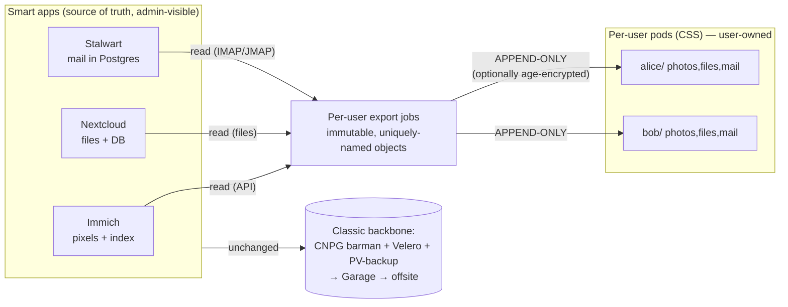

# Design exploration: personal data pods & user-owned data sovereignty

**Status:** Exploration / design note — *nothing here is implemented or committed to.*
Captures a design conversation so the reasoning isn't lost. Read
`doc/storage-and-backup.md` first for the storage/backup baseline this builds on.

**Date:** 2026-08-11

---

## 1. Why this doc exists

SmallWorlds today is a shared-community "sovereign cloud": one node, one Keycloak
realm, best-in-class apps (Immich, Stalwart, Nextcloud, Forgejo, Plane) whose data
is partitioned **by application** and commingled across users inside each app. We
explored whether user data could instead be **owned by the user** — portable,
per-user, and readable/removable by them — via a Solid-pod-style personal data
store, and what that would mean for backup and trust.

The exploration kept collapsing onto **one dividing line** that turns out to be the
real architectural boundary of the whole system.

---

## 2. The dividing line (the central insight)

Every question — encryption, per-user backup, Solid pods, per-app feasibility —
resolved to the same split:

```
        DUMB / PORTABLE / USER-OWNED            SMART / SERVER-PROCESSED / ADMIN-VISIBLE
        ------------------------------          ----------------------------------------
        Nextcloud raw files                     Nextcloud shares, metadata, config.php, DB
        Immich pixels + basic EXIF              Immich embeddings, faces, albums (pgvecto.rs index)
        Stalwart message corpus (.eml)          Stalwart mailbox state, Sieve, account config, DB
        (Forgejo repo blobs)                    Plane, Keycloak — relational, no clean per-user cut
```

- **Left side**: dumb storage. Fits a pod. Per-user by nature. Portable. Can be
  pushed append-only and encrypted per-user. This is where sovereignty is
  achievable *today*.
- **Right side**: the server-side compute + central indexes that make the apps
  worth running (ML photo search, full-text mail, sharing/permissions, identity).
  Cannot live in a dumb pod; must stay centralized; the server necessarily sees it
  in plaintext.

**Corollary:** you cannot maximize both "user owns everything" and "rich
server-side features" at once. Pods buy sovereignty for the left column by giving
up features; the current architecture keeps the features and delivers sovereignty
at the *server-ownership* + *backup* layer instead. The realistic target is a
**hybrid**: keep the smart apps, and additionally expose the left column as
user-owned pods.

---

## 3. Trust model — what pods do and don't change

Two distinct trust boundaries, mitigable to very different degrees:

| Boundary | Mitigable? | How |
|---|---|---|
| **Backup-host** (the member whose home holds the offsite box) | **Fully** | Client-side encryption (`rclone crypt` / `age`); Shamir *k-of-n* for the restore key |
| **Live-infra admin** (root on the node) | **Only partially** | Irreducible: whoever runs the metal that processes plaintext can read it and act below the audit layer |

Levers against the admin boundary (none eliminate it):
- **Reduce what's visible** — app-level E2EE, but it's mutually exclusive with
  server-side features (search/thumbnails/webmail). Works for vaults/chat, not
  photos/mail.
- **Reduce unseen action** — GitOps is the lever: signed commits + required second
  reviewer on the overlay; ArgoCD self-heal makes out-of-band `kubectl` changes
  visible and reverts them. The escape hatch is **node root** — guard SSH,
  minimize holders, break-glass.
- **Make action detectable** — stream k8s audit / Keycloak events / pgAudit
  off-box in real time to a hash-chained, append-only sink the admin can't rewrite.
  Detects gaps, not prevents; still real deterrence.

**Pods improve portability, per-user isolation, and blast-radius — NOT the
live-admin plaintext ceiling.** Extraction into a pod happens server-side in
plaintext (the server already holds the data). Only app-level E2EE moves that
ceiling. Say so plainly to members: the goal is *bounded, accountable, verifiable*
trust, not zero trust.

---

## 4. The pod model & ecosystem liveness (as of 2026-08)

Solid inverts app-vs-data: the **user owns a Pod**; apps are stateless views that
request scoped access. Identity = WebID; auth = Solid-OIDC (with DPoP); access
control = WAC/ACP. This is exactly the model this exploration re-derived from
backup/sovereignty requirements.

Liveness of the relevant projects (verify before betting on any):

| Project | State | Verdict |
|---|---|---|
| **AT Proto PDS** (Bluesky) | Production, at scale, officially self-hostable | Healthiest — but social-networking-shaped, *not* a files/photos/mail vault |
| **ActivityPods** (ActivityPub + Solid) | 2.0 shipped 2024; **3.0 funded (NLnet), ~Aug 2026** — "full Solid-OIDC compliance" + NextGraph (CRDT, *encrypted*) | Small but active; the NextGraph encryption work is the piece to watch |
| **Community Solid Server (CSS)** | Maintained but slow (7.x stable, 8.0 alpha; org still commits in 2026) | The one you'd run; treat as experimental/low-velocity |

**Reality:** the Solid *app* layer (replacements for Nextcloud/Immich/mail) is
largely demo-ware. There is **no** production Solid-native Immich or mailserver.
So the near-term role of a pod is a **sovereign home for file-shaped data**, not an
app-suite replacement.

---

## 5. CSS as a SmallWorlds tenant (sketch)

A pod server (`solid-pods` tenant) run *alongside* the smart apps. Standard tenant
shape (namespace, Deployment, Service, Ingress+cert-manager, PVC, ArgoCD app at
**sync-wave 1**), file storage backend on a `local-path` PVC, backed up via
`bases/garage-init-job` + `bases/pv-backup-job` like other file data.

**The one place CSS breaks the project's OIDC contract:** every other tenant is a
plain OIDC *relying party* (`bases/keycloak-client-job` → `keycloak-secret`). CSS
is an **identity provider itself**, speaking **Solid-OIDC** (a `webid` claim +
DPoP). Keycloak doesn't emit Solid-OIDC tokens out of the box.

| Phase | Approach | Trade-off |
|---|---|---|
| **1 (start)** | CSS built-in IdP; do **not** use `keycloak-client-job` | Works today; **separate login** from the rest of SmallWorlds |
| **2 (later)** | Keycloak as Solid-OIDC issuer (webid protocol mapper + DPoP; CSS trusts Keycloak) | True SSO; fiddly — even ActivityPods treats this as a funded milestone |

**Gotcha:** the pod **base URL is identity** — WebIDs are absolute URLs baked into
the data (`https://pod.<domain>/alice/profile/card#me`). Changing the hostname
later breaks every WebID and inter-pod link. Pick the domain once.

---

## 6. Per-app fit — mirror the left column into pods

Do **not** make apps pod-native (no clean seam; loses features). Instead run a
**Level-1 export bridge**: a per-user job pushes each user's file-shaped data into
*their* pod as plain, immutable objects. The app stays the smart source of truth;
the pod is the user's portable, self-readable copy.

| App | Source | Export mechanism | Append-only fit | Notes |
|---|---|---|---|---|
| **Nextcloud** | per-user files on PVC | copy files → `pod/<user>/files/` | Good (files can change → some overwrite) | Cleanest data; leaves shares/metadata/DB behind |
| **Immich** | pixels on library PV + Postgres index | Immich API → `pod/<user>/photos/` | Good (photos immutable) | **Pixels only** — embeddings/faces/search stay in Immich DB |
| **Stalwart mail** | **all in Postgres** (no files) | IMAP/JMAP → Maildir/`.eml` | **Best** — messages are immutable, write-once | Corpus = append-only archive; mailbox *state* (flags/folders) is mutable, keep it out |
| Forgejo | git repos on PVC | copy → `pod/<user>/repos/` | OK | Owner-scoped; shared/org repos ambiguous |
| **Plane, Keycloak** | relational, commingled | — | — | **No clean per-user slice; not mirrored** |

Two structural limits that apply to all of them:
- **Shared objects have no single owner** (shared folders, co-owned albums, group
  repos, mailing lists) — Solid ACLs make sharing explicit, which helps, but
  ownership of shared items is still ambiguous.
- **Metadata leaks** (names, sizes, timing) unless the object payload itself is
  encrypted per-user (§7).

### Email is the standout fit

Email messages are **immutable by nature** → they map perfectly onto append-only,
write-once pod resources (`pod/<user>/mail/<folder>/<message-id>.eml`). The
mailbox *state* (read/unread, folder moves, deletes, Sieve) is the mutable part;
mirroring it needs `Write` and breaks append-only. **Recommendation: mirror the
immutable message corpus append-only** (a tamper-proof archive the server can grow
but never read or erase); treat live-state sync as an optional, more-privileged
extra.

---

## 7. Rights & keys — append-only is the killer feature

Solid access modes (WAC/ACP): **Read, Write, Append, Control.**

- **`Append`** = *add new resources only* — cannot read, overwrite, or delete
  existing ones. **This is the "write-only" the mirror wants.**

Grant each app's exporter **`Append` and nothing else** on the user's target
container:

- Server **can** deposit new objects.
- Server **cannot read** the user's pod history → a compromised app can't exfiltrate.
- Server **cannot delete/overwrite** → can't tamper or ransomware the user's data.

This is **strictly stronger than today's backup**, where `pv-backup` does `rclone
sync` and *mirrors deletions* (a compromised job can wipe the Garage copy).
Append-only pods are tamper-resistant by construction.

**Identity/keys:**
- Exporter authenticates as a **service agent** — its own WebID + one credential
  (client secret / DPoP key), e.g. `immich-service#me`, `stalwart-service#me`.
- Each user's pod ACL grants *that agent* `Append` on their container (one-time,
  automatable at pod provisioning). One service credential, per-pod grants — not
  hoarded per-user tokens.
- Reading *out of* the app still needs a read path to plaintext (Immich API key,
  Stalwart IMAP/JMAP admin or per-user creds) — unchanged trust reality; the
  server already holds the data.

**Constraints that keep it append-only:**
1. Write **immutable, uniquely-named** objects; never overwrite. (Email satisfies
   this for free; photos too; Nextcloud files need care.)
2. Track sync state **server-side** (a UID/asset cursor) — `Append` means you
   can't read the pod to diff.
3. **Deletion/pruning is not the server's job** — it's user-controlled or a
   separate narrowly-privileged agent. (A feature: retention is the user's call.)

**Optional per-user encryption:** `age`-encrypt each object to the user's public
key before append. The server then writes **ciphertext it can't read back**,
append-only — the strongest available combination, and it closes the metadata leak.
Trade-off dial for key recovery: user-only key (max privacy, no recovery help) →
Shamir/escrow → dual-recipient (user + community recovery key).



---

## 8. Pods do NOT become the sole backup center

Tempting but wrong. Pods hold only the **left-column, file-shaped, per-user
slice**, and only as **copies**. They have **no home** for:

- databases (Nextcloud/Immich/Plane/Stalwart/Keycloak Postgres),
- the Immich ML index, Nextcloud shares/metadata, mailbox state/Sieve,
- Keycloak identities, cluster Secrets, resource manifests.

Restoring "the pods" alone yields files with no working apps, no mail, no logins.
**Therefore the existing backbone stays unchanged** — CNPG barman (7d PITR),
Velero (30d cluster/secrets), `pv-backup` (app filesystems) → Garage → offsite.
Pods are a **complementary sovereignty/portability layer on top**, not a
replacement. (Only a full Level-2 "pod as primary file store" would let you back
up the pod *instead of* an app's file PVC — and even then every DB/index/mail
backup remains.)

---

## 9. Redundancy — how many copies of each data class

Governing rule: **a live copy in daily use is not a backup** — a backup must sit in
a *different failure domain* than the primary. Count independent failure domains,
not files. Two consequences specific to this single-node cluster:

- **CNPG `instances: 2`** is a primary + replica for *failover*, but both PVCs are
  on the **same physical disk** — HA, not durability. Counts as **1** durable copy.
- **In-cluster Garage** runs `replicationFactor: 1` on that **same disk**, so it
  counts as **0** independent instances for either data class. **Only the offsite
  copy is real redundancy.**

This also sharpens the §2 dividing line into **three** backup classes, because
"the DB is derived from the pod" is only 90% true:

| Class | Example | Regenerable from source? | Lives in | Durable backup? |
|---|---|---|---|---|
| **(a) Source** | photos, files, `.eml` | — (it *is* the source) | pod / home device | Yes — irreplaceable |
| **(b) Derived** | embeddings, thumbnails, transcodes, search vectors | Yes — recompute from (a) | central DB / caches | Optional (costs compute) |
| **(c) User intent** | album membership, the *name* given to a face, tags, folder org, mail flags, shares | **No** | central DB | **Yes — irreplaceable** |

Category **(c)** is the trap: it sits in the DB next to (b) but is *not* derived —
human decisions that can never be recomputed from pixels. So the conventional
central DB backup is **essential, not secondary**; the pod archive does not make it
optional.

### Source (append-only) data — aim for 3

| # | Instance | Failure domain | Role |
|---|---|---|---|
| 1 | Live on server (Immich library / Nextcloud PVC / mail) | node disk | primary (daily ops) |
| 2 | Central offsite backup (→ B2 / home box) | different provider/site | reliable, monitored backup |
| 3 | User home device (pull-based SSD) | user's home | sovereign copy |

Is **2** (server + device) enough? It is the bare minimum, and append-only helps
more than a mirror would: because objects are immutable and the device pulls
copy-not-sync, a *logical* disaster on the server (ransomware, mass-delete, admin
error) **does not propagate** to the device. The remaining risk is **physical,
correlated failure** — the home device is the least reliable component (single
consumer SSD, user-managed, unmonitored, one location). For *irreplaceable* source,
keep **3**; the device is then a bonus sovereign copy and losing it is never data
loss. To honestly run at **2**, harden the device (mirrored disks + monitoring +
heartbeat) and accept single-site risk.

The home device is **pull-based**: it connects *outbound* to the cluster and fetches
its owner's new pod objects (read-only, prefix-scoped credential; `rclone copy`, not
`sync`). No inbound ports / dyndns at home; it can't write to or harm the cluster;
it catches up automatically after any offline stretch. Encrypt at rest (LUKS) and
report a heartbeat so a silently-dead box is noticed.

### DB (derived + intent) data — central only; 2 workable, 3 better

Stays **central** (commingled, not per-user-sliceable) — **never on user devices.**

| # | Instance | Counts as | Notes |
|---|---|---|---|
| 1 | CNPG live (primary + replica, same disk) | 1 durable | 2 pods = HA, not redundancy |
| 2 | Offsite barman archive (→ B2, versioned) | 1 independent | PITR: base + continuous WAL, 7-day depth |
| — | in-cluster Garage staging | 0 | same disk |

**Minimum 2** (live + one *offsite*), and that offsite is stronger than a flat
snapshot — barman PITR + B2 versioning make it a time-layered history from one
location. Because it holds the irreplaceable **(c)**, the right target is **3**: a
*second* offsite domain (home box or a different provider) so a single
provider/account failure isn't total loss. **(b)** alone could be regenerated from
source, so the thing you protect to the "3" standard is really the small, precious
**(c)**.

> **Considered and deferred (2026-08-11):** moving **(c)** into the pods too — so
> the pod holds everything irreplaceable and the DB becomes a pure disposable
> cache — is feasible but not worth the effort now. Two reasons: intent is
> *mutable* (it fits only as append-only versioned snapshots, per-app custom
> export), and there is *no DB-reconstruction tooling*, so pod-stored intent would
> be an owned copy, not a restore path — it wouldn't let us drop the central DB
> backup anyway. Intent stays central; revisit if reconstruction tooling is built.

### Summary

| Data | Practical minimum | Recommended | On user devices? |
|---|---|---|---|
| **Source (append-only)** | 2 (live + device) — thin | **3** (live + central offsite + device) | **Yes** |
| **DB (derived + intent)** | 2 (live + versioned offsite) | **3** (live + 2 offsite domains) | **No** |

The offsite leg is the copy that actually matters — the in-cluster Garage on the
shared disk counts toward none of these numbers, which is why provisioning a real
offsite target remains the #1 open task (§10) before any of this redundancy is real.

---

## 10. Open questions & possible next steps

Nothing below is scheduled; listed roughly easiest→hardest.

1. **Offsite leg first (prerequisite, unrelated to pods).** The backbone still
   isn't actually offsite — provision the B2 (or first home-box) `dest:` per
   `doc/storage-and-backup.md` §8. Everything else is moot until one real backup
   copy leaves the node.
2. **Encrypt + Shamir the offsite mirror** — `rclone crypt` + *k-of-n* restore
   key. Solves the backup-host trust boundary cleanly.
3. **Lock the GitOps path** — signed commits + required reviewer on the overlay;
   rely on ArgoCD self-heal for drift. Cheap admin-accountability win.
4. **`solid-pods` tenant, Phase 1** — CSS with its built-in IdP as an opt-in
   experimental tenant (add to `OPTIONAL_APPS`). File-shaped data only.
5. **One append-only export bridge** as a proof — start with **mail** (best fit)
   or **Nextcloud files** (cleanest data): per-user job, `Append`-only grant,
   server-side cursor, optional `age` encryption.
6. **Phase 2 identity** — Keycloak `webid` mapper + DPoP so pods join SSO; gate on
   Keycloak's DPoP maturity and/or ActivityPods 3.0's Solid-OIDC work.

## 11. One-paragraph summary

Files (Nextcloud), pixels (Immich), and mail (Stalwart) all reduce to the same
shape: **immutable, per-user, append-only objects that can be pushed blindly into a
pod the server can't read.** A CSS pod tenant plus per-app append-only export
bridges gives members genuine data ownership, portability, and per-user
isolation — a complementary layer over an unchanged per-app backup backbone. It
does **not** replace that backbone (databases/indexes/identity have no pod home)
and it does **not** move the live-admin plaintext ceiling (only app-level E2EE
does). The whole design rests on one boundary: dumb/portable/user-owned data on one
side, smart/server-processed/admin-visible data on the other.
