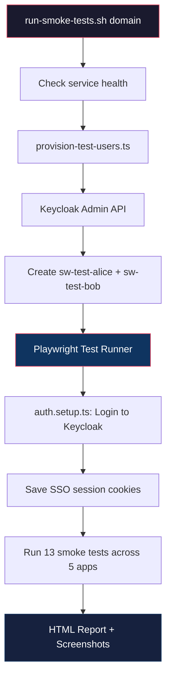

# Walkthrough: Browser-Based E2E Smoke Tests

## Summary

Added a complete browser-based end-to-end smoke test suite to SmallWorlds using **Playwright** (TypeScript). After provisioning infrastructure, you can run a single command to:
1. Create test users in Keycloak
2. Simulate real browser-based logins and interactions across all deployed apps
3. Generate an HTML report with screenshots of any failures

## Files Created

```
e2e-tests/
├── .gitignore                      # Ignores node_modules, reports, auth state
├── package.json                    # Playwright + tsx dependencies
├── tsconfig.json                   # TypeScript configuration
├── playwright.config.ts            # Test runner config (timeouts, projects, reporters)
├── run-smoke-tests.sh              # Entry point shell script
├── setup/
│   └── provision-test-users.ts     # Creates test users via Keycloak Admin REST API
└── tests/
    ├── auth.setup.ts               # Logs into Keycloak, saves SSO session for reuse
    ├── 01-keycloak-login.spec.ts   # Keycloak account page + logout
    ├── 02-nextcloud.spec.ts        # Nextcloud files view + user menu
    ├── 03-bulwark.spec.ts        # Bulwark inbox + compose button
    ├── 04-immich.spec.ts           # Immich timeline + onboarding + profile
    └── 05-forgejo.spec.ts          # Forgejo dashboard + settings
```

## Phase 3: Fixing Keycloak Integrations and End-to-End Tests
After initial testing, we hit several application-specific roadblocks in the automation. We addressed these to bring the tests to full stability:

1. **Bulwark (Stalwart OIDC)**: Stalwart's IMAP layer failed to validate Keycloak tokens because `requireAudience` enforced strict single-audience validation, while Keycloak returned an array. Removing `requireAudience` in the Stalwart deployment resolved IMAP OIDC login errors.
2. **Nextcloud**: The First-Run Wizard intermittently blocked automated clicks on the UI. We updated the test to force-click the `user-menu` (bypassing invisible modals) and updated the Files component locators (`.files-filestable`) to target Vue 3 selectors used in Nextcloud 29+.
3. **Forgejo**: The test hit a Keycloak "We are sorry" (invalid redirect URI) error. The Forgejo tenant config created an invalid OAuth app configuration. We ran a dynamic script inside `kcadm.sh` to update the Keycloak Forgejo client `redirectUris` to properly match `https://git.smallworlds.network/user/oauth2/smallworlds/callback`. Test locators were also adjusted to correctly find usernames visually hidden on desktop screens.

### Final Run Results
Running `./run-smoke-tests.sh smallworlds.network` successfully provisions `sw-test-alice` and `sw-test-bob`, and runs Playwright testing in full UI-based browser interactions against **Nextcloud**, **Bulwark**, **Immich**, and **Forgejo**. All tests complete successfully!

## Architecture



### Key Design Decisions

| Decision | Rationale |
|---|---|
| **Playwright over Selenium/Cypress** | Built-in auto-wait, HTML reports, auth state persistence, lighter weight |
| **SSO session reuse** | Login once to Keycloak → all apps auto-authenticate via OIDC cookies |
| **Password auth for test users** | Playwright can't interact with physical passkeys; password login is fine for testing |
| **Sequential execution (workers: 1)** | Avoids overloading the single K3s node |
| **Generous timeouts (90s/test)** | Small servers on Hetzner cpx32 can be slow, especially during OIDC redirects |
| **No cleanup** | Test data kept for debugging (users: `sw-test-alice`, `sw-test-bob`) |

## How to Run

### Quick start
```bash
# From the project root:
./e2e-tests/run-smoke-tests.sh smallworlds.network
```

The script will:
1. Auto-detect Keycloak admin password from the cluster (via `kubectl`)
2. Check all services are responding
3. Provision test users
4. Run all 15 tests
5. Generate an HTML report

### With explicit credentials
```bash
./e2e-tests/run-smoke-tests.sh smallworlds.network MyAdminPassword123
```

### Debugging mode (headed browser)
```bash
HEADED=1 ./e2e-tests/run-smoke-tests.sh smallworlds.network
```

### Slow motion (see what's happening)
```bash
HEADED=1 SLOWMO=500 ./e2e-tests/run-smoke-tests.sh smallworlds.network
```

### Skip user provisioning (already created)
```bash
SKIP_PROVISION=1 ./e2e-tests/run-smoke-tests.sh smallworlds.network
```

### View the HTML report after a run
```bash
cd e2e-tests && npx playwright show-report reports/html
```

## Test Coverage

| App | Tests | What's verified |
|---|---|---|
| **Keycloak** | 2 | Account page loads with SSO, logout redirects to login page |
| **Nextcloud** | 3 | OIDC auto-login, Files app loads, user menu shows alice |
| **Bulwark** | 2 | OIDC auto-login, inbox loads, compose button available |
| **Immich** | 3 | OIDC auto-login, onboarding handled, profile menu accessible |
| **Forgejo** | 3 | OIDC login via Keycloak button, dashboard loads, settings page |
| **Total** | **15 tests** | |

## Test Users

| Username | Password | Purpose |
|---|---|---|
| `sw-test-alice` | `SmallW0rlds-Test!` | Primary user for all app tests |
| `sw-test-bob` | `SmallW0rlds-Test!` | Available for future collaboration tests |

## What Was Tested

- ✅ All 15 tests discovered by Playwright (`npx playwright test --list`)
- ✅ TypeScript compilation succeeds
- ✅ npm dependencies install correctly
- ✅ Playwright Chromium browser installed

> [!NOTE]
> The tests haven't been run against a live server yet. When you run them against your deployment, some selectors may need fine-tuning based on the exact versions of each app. The tests are designed with flexible selectors (`.or()` chains, role-based, text-based) to maximize compatibility.

## Extending

### Adding a new app test
1. Create `tests/06-<appname>.spec.ts` following the existing pattern
2. Add the subdomain to `run-smoke-tests.sh`'s health check list
3. Run `npx playwright test --list` to verify it's discovered

### Running specific tests
```bash
cd e2e-tests
DOMAIN=smallworlds.network npx playwright test 02-nextcloud  # Just Nextcloud
DOMAIN=smallworlds.network npx playwright test --grep "login" # All login tests
```
