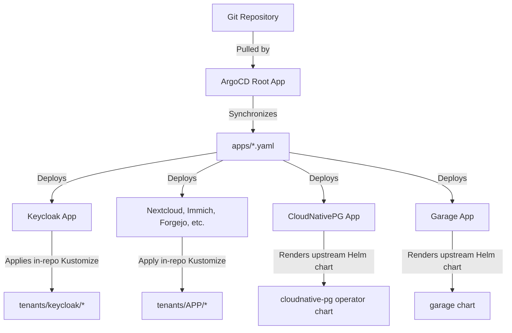
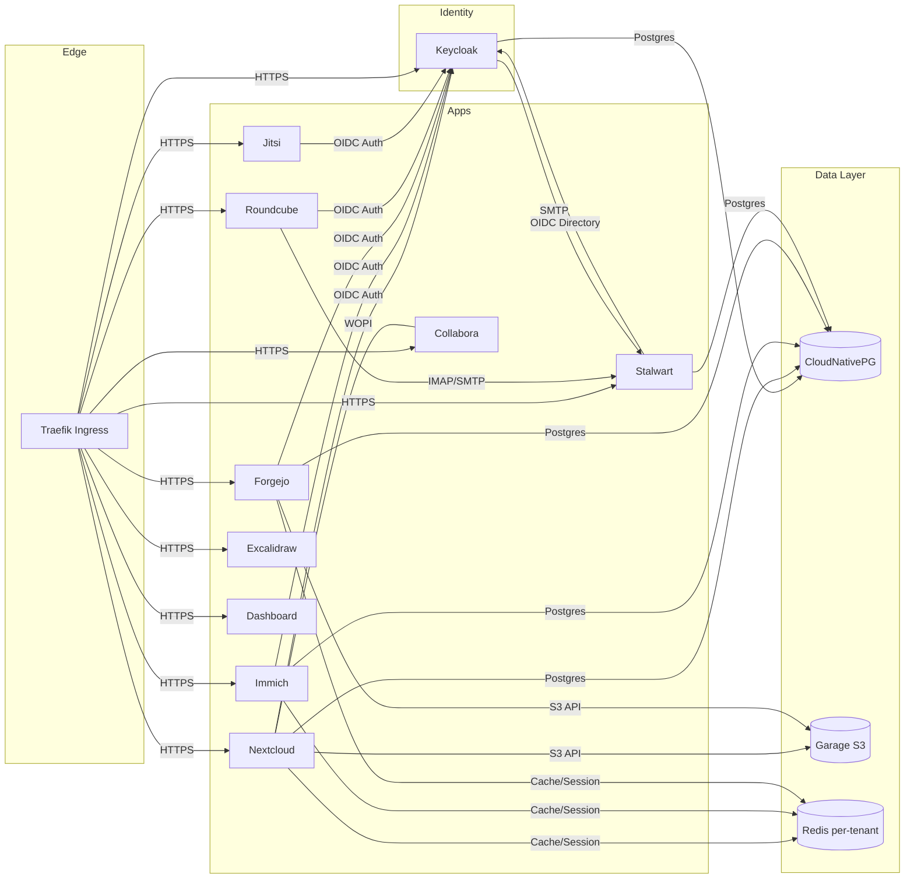

# SmallWorlds Architecture

A deep dive into the GitOps workflow, ArgoCD setup, and the seamless collaboration between infrastructure components.

> This is the GitHub-rendered version of the architecture guide. A styled standalone HTML version is also available at [`smallworlds_architecture.html`](smallworlds_architecture.html) (open it locally — GitHub serves `.html` as source, not a rendered page).

## 1. The GitOps Bootstrap (ArgoCD Setup)

The entire SmallWorlds cluster is managed declaratively using ArgoCD. The initialization sequence ensures that as soon as the Kubernetes (K3s) cluster boots, it immediately pulls its desired state from your Git repository.

**`infrastructure/terraform/cloud-init.yaml.tpl`**

When the VM boots, Cloud-init installs K3s and immediately applies the ArgoCD installation manifest. Once ArgoCD is running, it applies the `argocd-root-app.yaml`. K3s automatically processes any manifest dropped into `/var/lib/rancher/k3s/server/manifests/`, making this the perfect hook for our root application.

**`/tmp/argocd-root-app.yaml` (generated via cloud-init)**

This root Application defines the **App of Apps** pattern. It points ArgoCD to the repository defined by `git_url` and watches the root directory. This tells ArgoCD to synchronize all the application definitions found in `infrastructure/kubernetes/apps/`.

## 2. The App of Apps Architecture

The `infrastructure/kubernetes/apps/` directory contains individual ArgoCD `Application` manifests for every component in the cluster. Most of these — the end-user apps and Keycloak — point to a specific in-repo tenant directory (e.g., `infrastructure/kubernetes/tenants/keycloak/`) rendered with Kustomize. The core operators (CloudNativePG, Garage, Traefik, cert-manager, the monitoring/logging stacks, trivy-operator) instead reference an upstream Helm chart directly, so they have no in-repo `tenants/` directory.

> **Two kinds of Application.** In-repo tenants (all the end-user apps plus Keycloak) point at an `infrastructure/kubernetes/tenants/<name>` directory rendered with Kustomize. Core operators — **CloudNativePG, Garage, Traefik, cert-manager, kube-prometheus-stack, loki-stack, trivy-operator** — instead reference an **upstream Helm chart** directly; there is no in-repo `tenants/` folder for them.

## 3. Core Infrastructure Components Integration

The foundation of the cluster relies on three main pillars working together: Storage, Routing, and Databases.

**Persistent Storage — Hetzner Local Storage**
`persistent-storage.yaml` creates a `StorageClass` named `hetzner-local`. This maps Kubernetes PVCs directly to the physical Hetzner volume mounted at `/mnt/smallworlds-data`, ensuring data survives VM recreation.

**Networking — Traefik & Cert-Manager**
`traefik.yaml` and `cert-manager.yaml` manage routing and TLS. Cert-manager watches for Ingress resources and automatically negotiates Let's Encrypt certificates. Traefik serves as the unified entry point for all subdomains (identity, files, photos, etc.).

**Databases — CloudNativePG (CNPG)**
Instead of deploying disparate database instances, the cluster uses CNPG. For example, Keycloak's tenant directory contains `cnpg-cluster.yaml` which tells the operator to spin up a highly available Postgres cluster exclusively for Keycloak. Nextcloud, Immich, and Forgejo follow this identical pattern.

**Object Storage — Garage S3**
`garage.yaml` deploys an S3-compatible object store. Each tenant provisions its own storage in isolation: every app runs its own `garage-init-job.yaml` (from the shared `bases/garage-init-job` base) during its sync phase, which uses the Garage CLI to create that tenant's own bucket plus a dedicated `postgres-backups-<tenant>` bucket, and generates S3 access keys stored in per-tenant K8s secrets (`garage-secret`, `garage-secret-cnpg`). This per-app isolation means one tenant's credentials never grant access to another's data.

## 4. Identity Provider (Keycloak) Configuration

Keycloak is the heart of the SmallWorlds authentication architecture. Every application delegates its login flow to Keycloak via OpenID Connect (OIDC).

**`infrastructure/kubernetes/tenants/keycloak/smallworlds-realm.json`**

This massive JSON file defines the entire state of the identity provider. Key integrations include:

- **OIDC Clients:** Pre-registers clients for `nextcloud`, `immich`, `forgejo`, and `dashboard`. It defines their redirect URIs and client secrets.
- **Passkey (WebAuthn) Flow:** Overrides the default browser flow to enforce passwordless WebAuthn authentication.
- **SMTP Integration:** Configured to use the internal DNS name of Stalwart (`stalwart-mail.stalwart.svc.cluster.local:25`) to send invitation emails. The SMTP password is injected dynamically from a Kubernetes secret using `sed` (substituting `${env.STALWART_PASSWORD}` in the realm JSON) during the `realm-config-job`.

**`infrastructure/kubernetes/tenants/keycloak/realm-config-job.yaml`**

Because the Realm JSON is static in Git, this post-sync job executes the Keycloak Admin CLI (`kcadm.sh`) to import the JSON and dynamically patch in sensitive secrets (like the Stalwart SMTP password and Bulk Invite secrets) without exposing them in the repository.

## 5. Application Collaboration & Integration

Here is how the applications wire themselves into the core infrastructure defined above:

**Nextcloud**
The base install is driven by its Helm `values.yaml` (CNPG Postgres via environment variables, primary storage mapped to its Garage S3 bucket). OIDC, however, is wired up after install by the `oidc-config-job.yaml` hook, which uses `kubectl exec` + `php occ` to install the **`user_oidc`** app, register the `smallworlds` provider against Keycloak's discovery URL, and read the client secret from the `keycloak-secret` Kubernetes secret.

**Immich**
Immich lacks declarative configuration for OIDC in its Helm chart. Therefore, an **ArgoCD Sync Hook** (`admin-init-job.yaml`) runs a script that hits the Immich REST API. It creates the initial admin user, logs in to get a JWT, and then submits a JSON payload to the `/api/system-config` endpoint to enable OIDC and bind it to Keycloak.

**Roundcube & Stalwart Mail**
Stalwart mail is wired to Keycloak as an **OIDC Directory**, configured imperatively by the `stalwart-init-job` via the Stalwart CLI (not via a static TOML file). Roundcube (the webmail UI) mounts a static `oauth-config.inc.php` from the `roundcube-oauth-config.yaml` ConfigMap, which points IMAP/SMTP at Stalwart's internal service and sets up the `oauth2`/`XOAUTH2` flow to authenticate users silently against Keycloak.

## System Topology Map

