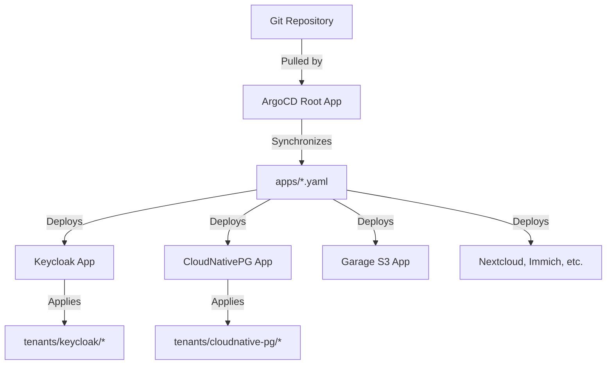
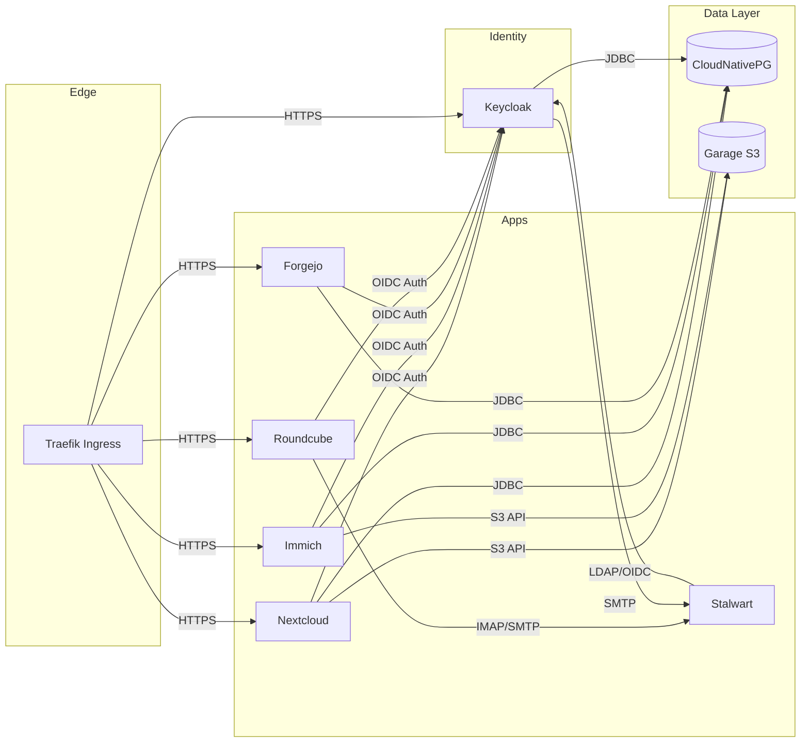

# SmallWorlds Architecture

A deep dive into the GitOps workflow, ArgoCD setup, and the seamless collaboration between infrastructure components.

> This is the GitHub-rendered version of the architecture guide. A styled standalone HTML version is also available at [`smallworlds_architecture.html`](smallworlds_architecture.html) (open it locally — GitHub serves `.html` as source, not a rendered page).

## 1. The GitOps Bootstrap (ArgoCD Setup)

The entire SmallWorlds cluster is managed declaratively using ArgoCD. The initialization sequence ensures that as soon as the Kubernetes (K3s) cluster boots, it immediately pulls its desired state from your Git repository.

**`infrastructure/terraform/cloud-init.yaml.tpl`**

When the VM boots, Cloud-init installs K3s and immediately applies the ArgoCD installation manifest. Once ArgoCD is running, it applies the `argocd-root-app.yaml`. K3s automatically processes any manifest dropped into `/var/lib/rancher/k3s/server/manifests/`, making this the perfect hook for our root application.

**`/tmp/argocd-root-app.yaml` (generated via cloud-init)**

This root Application defines the **App of Apps** pattern. It points ArgoCD to the repository defined by `git_url` and watches the root directory. This tells ArgoCD to synchronize all the application definitions found in `infrastructure/kubernetes/apps/`.

## 2. The App of Apps Architecture

The `infrastructure/kubernetes/apps/` directory contains individual ArgoCD `Application` manifests for every component in the cluster. Each of these manifests points to a specific tenant directory (e.g., `infrastructure/kubernetes/tenants/keycloak/`) where the actual Kustomize or Helm definitions live.

## 3. Core Infrastructure Components Integration

The foundation of the cluster relies on three main pillars working together: Storage, Routing, and Databases.

**Persistent Storage — Hetzner Local Storage**
`persistent-storage.yaml` creates a `StorageClass` named `hetzner-local`. This maps Kubernetes PVCs directly to the physical Hetzner volume mounted at `/mnt/smallworlds-data`, ensuring data survives VM recreation.

**Networking — Traefik & Cert-Manager**
`traefik.yaml` and `cert-manager.yaml` manage routing and TLS. Cert-manager watches for Ingress resources and automatically negotiates Let's Encrypt certificates. Traefik serves as the unified entry point for all subdomains (identity, files, photos, etc.).

**Databases — CloudNativePG (CNPG)**
Instead of deploying disparate database instances, the cluster uses CNPG. For example, Keycloak's tenant directory contains `cnpg-cluster.yaml` which tells the operator to spin up a highly available Postgres cluster exclusively for Keycloak. Nextcloud, Immich, and Forgejo follow this identical pattern.

**Object Storage — Garage S3**
`garage.yaml` deploys an S3-compatible object store. Crucially, Keycloak executes a `garage-init-job.yaml` during its sync phase. This job uses the Garage CLI to dynamically create the `nextcloud` and `immich` buckets and generates S3 access keys, storing them securely in K8s secrets for those apps to consume.

## 4. Identity Provider (Keycloak) Configuration

Keycloak is the heart of the SmallWorlds authentication architecture. Every application delegates its login flow to Keycloak via OpenID Connect (OIDC).

**`infrastructure/kubernetes/tenants/keycloak/smallworlds-realm.json`**

This massive JSON file defines the entire state of the identity provider. Key integrations include:

- **OIDC Clients:** Pre-registers clients for `nextcloud`, `immich`, `forgejo`, and `dashboard`. It defines their redirect URIs and client secrets.
- **Passkey (WebAuthn) Flow:** Overrides the default browser flow to enforce passwordless WebAuthn authentication.
- **SMTP Integration:** Configured to use the internal DNS name of Stalwart (`stalwart-mail.stalwart.svc.cluster.local:25`) to send invitation emails. The SMTP password is injected dynamically via Kubernetes secrets using `jq` during the `realm-config-job`.

**`infrastructure/kubernetes/tenants/keycloak/realm-config-job.yaml`**

Because the Realm JSON is static in Git, this post-sync job executes the Keycloak Admin CLI (`kcadm.sh`) to import the JSON and dynamically patch in sensitive secrets (like the Stalwart SMTP password and Bulk Invite secrets) without exposing them in the repository.

## 5. Application Collaboration & Integration

Here is how the applications wire themselves into the core infrastructure defined above:

**Nextcloud**
Configured entirely via its Helm `values.yaml`. It references the CNPG Postgres cluster via environment variables. For OIDC, it uses the `social_login` plugin, hardcoding the Keycloak endpoints and reading the client secret from the `nextcloud-admin-creds` Kubernetes secret. It maps its primary storage to the S3 bucket created by the Garage Init Job.

**Immich**
Immich lacks declarative configuration for OIDC in its Helm chart. Therefore, an **ArgoCD Post-Sync Hook** (`admin-init-job.yaml`) runs a bash script that hits the Immich REST API. It creates the initial admin user, logs in to get a JWT, and then submits a JSON payload to the `/api/system-config` endpoint to enable OIDC and bind it to Keycloak.

**Roundcube & Stalwart Mail**
Stalwart mail is configured via TOML to use Keycloak as its LDAP/OIDC provider. Roundcube (the webmail UI) uses a custom `runtime-config.sh` script. Because Roundcube is PHP-based, this script dynamically generates the `config.inc.php` at startup, injecting the IMAP/SMTP endpoints of Stalwart and setting up the `oauth2` plugin to authenticate users silently against Keycloak.

## System Topology Map

